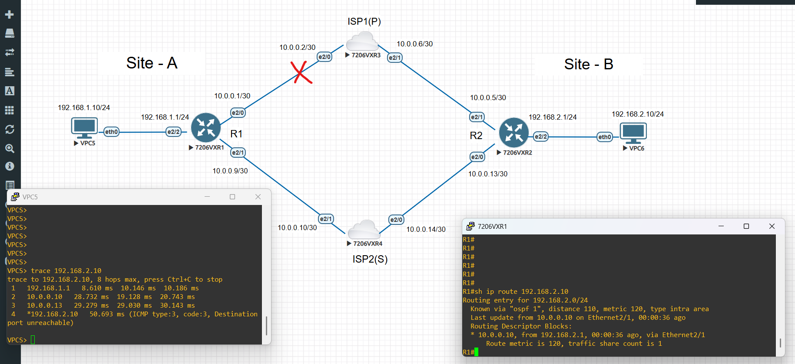
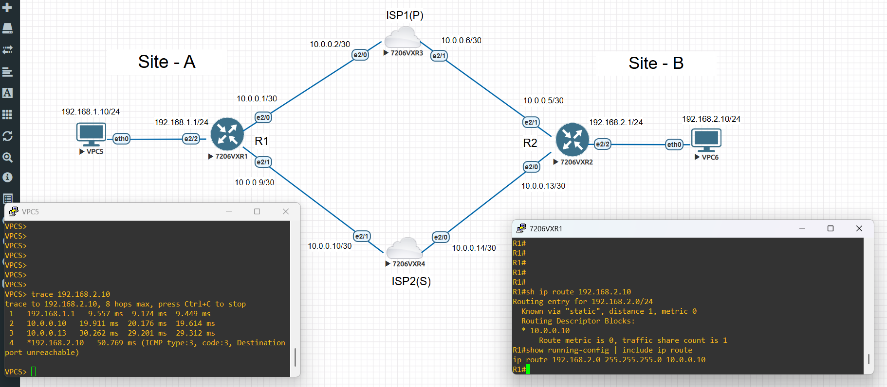

# LAB-007 — AI Organizational Decision Memory & Change Risk Intelligence

## Overview

LAB-007 demonstrates an **AI-powered Organizational Decision Memory and Change Risk Intelligence platform** designed for IT and Network environments.

The system captures **architectural and operational decisions**, models their **relationships and dependencies**, and applies AI-driven reasoning to explain **why decisions were made** and **what risks emerge when changes occur**.

This represents a shift from traditional network automation toward **decision-aware infrastructure intelligence**.

> **Note:** The core intelligence engine and backend implementation have been moved to a private repository as part of productization. This public lab showcases architecture, concepts, validation scenarios, and system capabilities.

---

## The Problem

Modern infrastructure environments suffer from **decision entropy**:

- Historical decisions are undocumented or fragmented  
- Knowledge resides in tickets, emails, or individuals  
- Architectural intent is lost over time  
- Operational workarounds accumulate hidden risk  

During incidents or change planning, teams frequently ask:

- *Why was this implemented?*  
- *What depends on this?*  
- *What could break if we modify it?*

Traditional tools manage configurations — **not decision logic**.

---

## The Solution

This platform introduces **Decision Intelligence for Infrastructure**.

It functions as:

- **Organizational memory** for technical decisions  
- A **decision relationship graph** linking architecture and operations  
- An **AI reasoning layer** that explains dependencies and impact  
- A **change risk awareness system** for safer evolution of environments  

Instead of storing only *what exists*, the system stores **why it exists**.

---

## Example Scenario (EVE-NG Validation Lab)

A dual-ISP topology is deployed in a lab environment to simulate real enterprise WAN design.

During a failover incident, a static route workaround is introduced to restore traffic.

The system records:

| Decision Type | Description |
|--------------|-------------|
| Architectural Decision | Dual-ISP design and routing model |
| Operational Decision | Static route workaround during outage |
| Relationship | Workaround depends on and alters design intent |

The AI layer can then:

- Explain **why** the workaround was introduced  
- Identify risks such as routing asymmetry and blackholing  
- Show how the workaround increases future troubleshooting complexity  
- Evaluate impact if the base architecture changes  

This demonstrates **architecture reasoning**, not just configuration automation.

---

## Use Cases

- Change governance and CAB decision support  
- Post-incident knowledge retention  
- Architecture decision traceability  
- Risk-aware change planning  
- Operational memory for complex environments  
- Cross-team knowledge continuity  

---

## Project Context

LAB-007 is part of the ScriptMyNetwork journey, representing an evolution from:

**Network Automation → Decision Intelligence → Change Risk Awareness**

It validates how AI can operate as a **technical reasoning layer** over infrastructure decisions.

---

## EVE-NG Impact Demonstration

This lab scenario illustrates how an operational workaround can introduce architectural risk.

### Scenario

- Dual ISP topology between sites  
- Primary link failure simulated  
- Static route added to restore traffic  

### Outcome

The AI system identifies that this tactical decision:

- Alters original routing intent  
- Introduces asymmetric traffic paths  
- Increases failure-domain complexity  
- Raises future troubleshooting and outage risk  

---

### Evidence

| Stage | Screenshot |
|------|------------|
| Primary path |  |
| Failover |  |
| Static workaround |  |
| AI impact reasoning |  |
